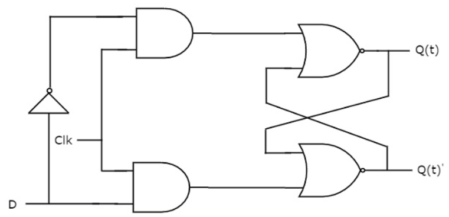

# D Flip-Flop

The D flip-flop is a fundamental sequential logic device used in digital circuits to store one bit of information. It is also referred to as a "delay" flip-flop due to its ability to delay the input signal based on the clock.

## Structure

The D flip-flop has a single data input, D, and two outputs, Q (normal output) and Q' (complementary output).

## Functionality

The D flip-flop has two primary inputs:
- **D (Data) input:** This input determines the value to be stored in the flip-flop.
- **Clock input:** This input synchronizes the operation of the flip-flop with the clock signal.

The functionality of the D flip-flop is as follows:
- When the clock input transitions from low to high (rising edge), the output of the flip-flop changes to the value present at the D input.
- When the clock input transitions from high to low (falling edge), the output of the flip-flop remains unchanged.

## Operation

- **Data Storage**: The D flip-flop stores the value present at its data input, D, when the clock signal transitions from low to high.
- **No Change**: The flip-flop maintains its current state when the clock signal is low or transitions from high to low.

## Truth Table

| D | Clock | Q(t)  |  !Q(t) |
|---|-------|-------|--------|
| 0 | ↓     |   0   |    1   |
| 1 | ↓     |   1   |    0   |
| x | ↑     | Memory| Memory |

## Applications

- **Registers**: Used as building blocks in registers for data storage.
- **Latch Circuits**: Employed in latch circuits for temporary data storage.
- **Clock Signal Synchronization**: Utilized in circuits to synchronize data with clock signals.

## Implementation

D flip-flops can be implemented using various methods, including using basic logic gates such as NAND gates or NOR gates, or using more complex sequential logic circuits.

## Simulated Waveforms

- Waveform of the simulation with Clock:
  

## Conclusion

The D flip-flop is a crucial component in digital circuits, offering simple yet effective data storage capabilities synchronized with clock signals. Understanding its operation is essential for designing reliable digital systems.
