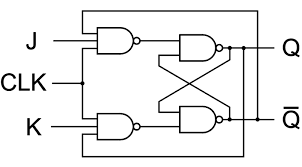

# JK Flip-Flop

The JK flip-flop is a sequential logic device that can store one bit of information. It is a modification of the SR flip-flop with added functionality to prevent the invalid state.

## Structure

The JK flip-flop consists of two inputs, J (set) and K (reset), and two outputs, Q (normal output) and Q' (complementary output). It also has a clock input (CLK).

## Operation

- **Set State**: When J=1 and K=0, the flip-flop is set (Q=1).
- **Reset State**: When J=0 and K=1, the flip-flop is reset (Q=0).
- **Toggle State**: When J=1 and K=1, the flip-flop toggles its state.
- **No Change**: When both J and K are 0, the flip-flop maintains its previous state.

## Truth Table

| J | K | Q(t)  |  !Q(t) |
|---|---|-------|--------|
| 0 | 0 |Memory | Memory |
| 0 | 1 |   0   |   1    |
| 1 | 0 |   1   |   0    |
| 1 | 1 |!Memory|!Memory |

## Applications

- **Frequency Division**: Used in frequency dividers.
- **Data Storage**: Forms the basic building block of sequential circuits.
- **Registers**: Used in shift registers and counters.

## Implementation

JK flip-flops can be constructed using basic logic gates such as NAND gates or NOR gates.

## Conclusion

The JK flip-flop is a versatile sequential logic device with multiple applications in digital electronics. Understanding its operation and characteristics is fundamental in digital circuit design.
