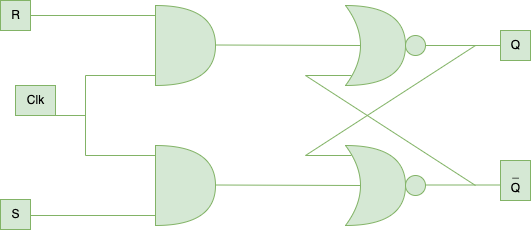

# SR Flip-Flop

The SR flip-flop, also known as the Set-Reset flip-flop, is a fundamental building block in digital electronics used for storing one bit of data. It has two inputs, S (set) and R (reset), and two outputs, Q and Qn (the complement of Q).

## Structure

The SR flip-flop typically consists of two NAND gates or two NOR gates. The outputs of each gate are connected to the inputs of the other gate, forming a feedback loop.

## Operation

- **Set State (S=1, R=0)**: When the S input is high and the R input is low, the flip-flop enters the set state. This means the Q output becomes high (1), and the Qn output becomes low (0).
- **Reset State (S=0, R=1)**: Conversely, when the S input is low and the R input is high, the flip-flop enters the reset state. Now, the Q output becomes low (0), and the Qn output becomes high (1).
- **Hold State (S=0, R=0)**: When both S and R inputs are low, the flip-flop maintains its current state. This is commonly known as the hold state.
- **Invalid State (S=1, R=1)**: When both S and R inputs are high, the flip-flop enters an undefined or forbidden state. In practical applications, this state is avoided as it can lead to unpredictable behavior.

## Truth Table

| S | R | Q(t)  |  !Q(t) |
|---|---|-------|--------|
| 0 | 0 |Memory | Memory |
| 0 | 1 |   0   |   1    |
| 1 | 0 |   1   |   0    |
| 1 | 1 |Invalid|Invalid |

## Simulated WaveForms

- Wave-Form of the simulation with Clock:
  

## Applications

- **Latch**: The SR flip-flop can be used to create a simple latch circuit for temporary storage of data.
- **Control Circuits**: It is commonly used in control circuits where sequential logic is required.
- **Debouncing**: In digital systems, SR flip-flops can be used for debouncing switches or push-buttons.

## Conclusion

The SR flip-flop is a basic yet important sequential logic device with applications in various digital systems. Understanding its operation and characteristics is fundamental for digital circuit design.
