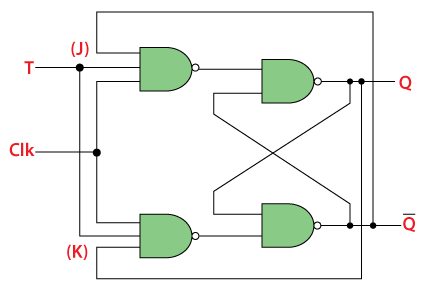
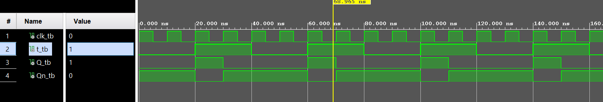

# T Flip-Flop

The T flip-flop is a type of sequential logic device that can store one bit of information. It is also known as a "toggle" flip-flop because it toggles its output state based on the input signal.

## Structure

The T flip-flop consists of a single input, T (toggle), and two outputs, Q (normal output) and Q' (complementary output).

## Operation

- **Toggle State**: When T transitions from 0 to 1, the flip-flop toggles its output state. If the current state is 0, it becomes 1, and vice versa.
- **No Change**: When T is held at a constant value (either 0 or 1), the flip-flop maintains its previous state.

## Truth Table

| T | Q(t)  |  !Q(t) |
|---|-------|--------|
| 0 |Memory | Memory |
| 1 |  !Q   |    Q   |

## Applications

- **Frequency Division**: Used in frequency dividers.
- **Clock Division**: Used in clock dividers.
- **Control Circuits**: Used for state control in digital systems.

## Implementation

T flip-flops can be implemented using various methods, including using basic logic gates such as NAND gates or NOR gates, or using more complex sequential logic circuits.

## Simulated WaveForms

- Wave-Form of the simulation with Clock:
  

## Conclusion

The T flip-flop is a simple yet powerful sequential logic device widely used in digital circuits for various applications. Understanding its operation and characteristics is fundamental in digital circuit design.
